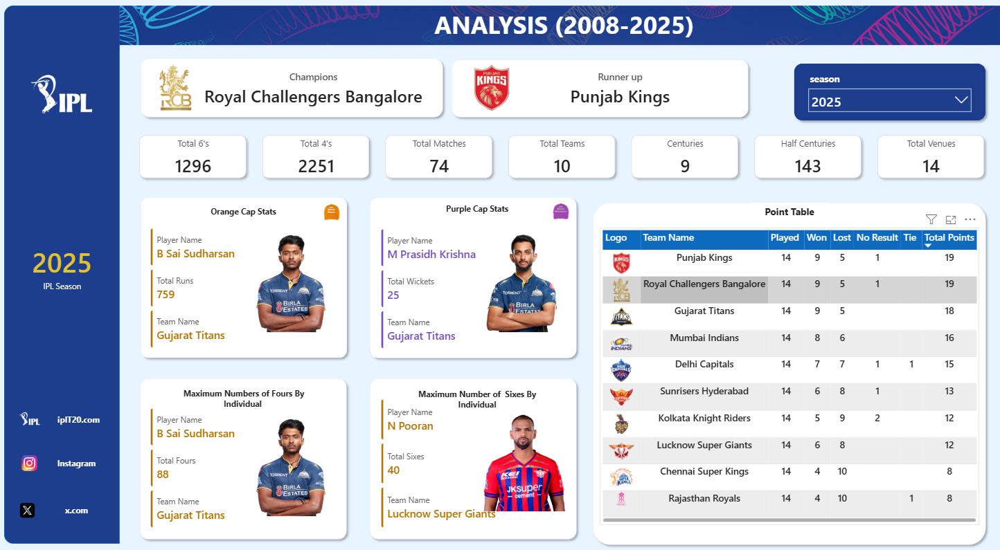
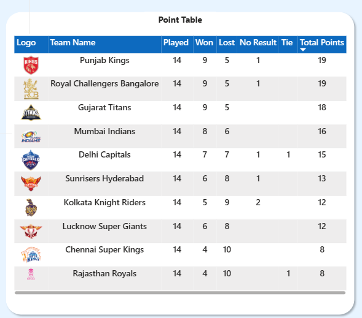
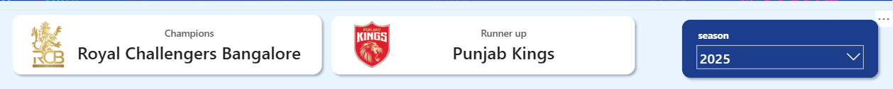
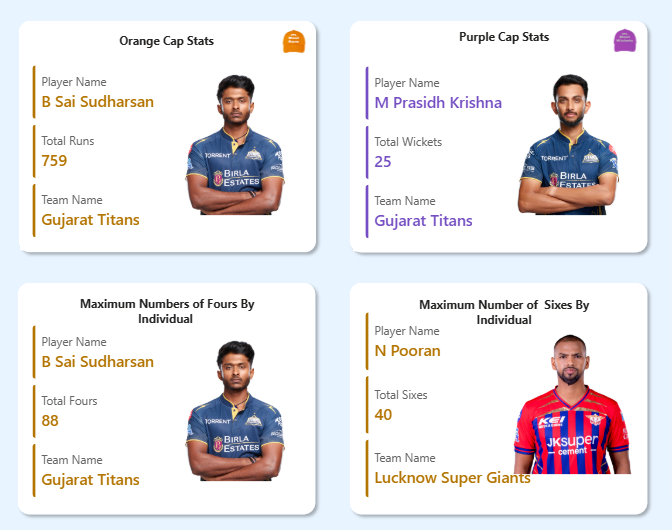
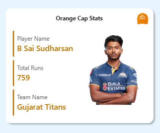
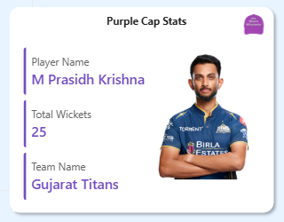

# 🏏 IPL Analytics Dashboard | Power BI

An interactive **Power BI Dashboard** that provides comprehensive insights into the Indian Premier League (IPL). The dashboard enables users to analyze team performance, player statistics, season-wise trends, venue analysis, and award winners through dynamic visualizations and advanced DAX measures.

---

## 📌 Project Overview

This project transforms raw IPL match and ball-by-ball datasets into an interactive analytics dashboard using **Power BI**, **Power Query**, and **DAX**.

Users can explore:

- Team Performance
- Player Performance
- Orange Cap & Purple Cap Holders
- Season-wise Statistics
- Match Results
- Venue Analysis
- Interactive Filters & Navigation

---

## ✨ Dashboard Features

### 📊 Home Dashboard
- IPL Season Selector
- Total Matches
- Total Teams
- Total Players
- Interactive Navigation

### 🏆 Team Analysis
- Matches Played
- Matches Won
- Matches Lost
- Win Percentage
- Total Points
- No Result Matches
- Tied Matches
- Team Logo
- Team Statistics Cards

### 👤 Player Analysis
- Player Profile
- Player Image
- Total Runs
- Strike Rate
- Batting Average
- Fours
- Sixes
- Half Centuries
- Centuries

### 🟠 Orange Cap Analysis
- Orange Cap Holder
- Player Image
- Team Name
- Total Runs

### 🟣 Purple Cap Analysis
- Purple Cap Holder
- Player Image
- Team Name
- Total Wickets

### 🔥 Season Highlights
- Season Winner
- Winning Team Logo
- Most Sixes
- Most Fours
- Highest Run Scorer
- Highest Wicket Taker

### 🏟 Venue Analysis
- Matches Played
- Venue-wise Statistics
- City-wise Analysis

---

## 📈 Key KPIs

- Matches Played
- Matches Won
- Matches Lost
- Win Percentage
- Points Table Statistics
- Orange Cap Holder
- Purple Cap Holder
- Total Runs
- Total Wickets
- Total Fours
- Total Sixes
- Half Centuries
- Centuries

---

## 🛠 Tech Stack

- **Power BI Desktop**
- **Power Query**
- **DAX**
- **Data Modeling**
- **Git & GitHub**

---

## 📂 Dataset

The dashboard is built using IPL datasets containing:

- Match Details
- Ball-by-Ball Data
- Team Information
- Player Information

---

## 🧠 DAX Measures

This dashboard uses advanced DAX measures including:

- Season Winner
- Orange Cap Holder
- Purple Cap Holder
- Total Runs
- Total Wickets
- Top Fours Player
- Top Sixes Player
- Half Centuries
- Centuries
- Matches Played
- Matches Won
- Matches Lost
- Total Points
- Dynamic Team Logo
- Dynamic Player Image
- Dynamic Season Statistics

---

## 📷 Dashboard Preview

### Home


### Point table 



### champions,Runnerup according to Season



### Player Analysis


### Orange Cap


### Purple Cap


---

## 📁 Project Structure

```
IPL-PowerBI-Dashboard
│
├── IPL Dashboard.pbix
├── README.md
│
├── Dataset
│   ├── ipl_matches.csv
│   ├── ball_by_ball.csv
│   ├── players.csv
│   └── teams.csv
│
├── Images
│   ├── Home.png
│   ├── Team_Analysis.png
│   ├── Player_Analysis.png
│   ├── Orange_Cap.png
│   ├── Purple_Cap.png
│   └── Dashboard.png
│
└── LICENSE
```

---

## 🚀 How to Use

1. Clone the repository

```
git clone https://github.com/yourusername/IPL-PowerBI-Dashboard.git
```

2. Open **IPL Dashboard.pbix** in **Power BI Desktop**.

3. Refresh the dataset if required.

4. Explore the dashboard using the interactive filters and slicers.

---

## 📌 Future Improvements

- Live IPL API Integration
- Real-Time Match Dashboard
- Predictive Analytics using Machine Learning
- Player Comparison Dashboard
- Fantasy Team Recommendation
- Mobile Optimized Layout

---

## 👨‍💻 Author

**Omkar Saple**

- GitHub:https://github.com/Omkar-Saple

---

## ⭐ If you found this project useful, don't forget to Star the repository!
